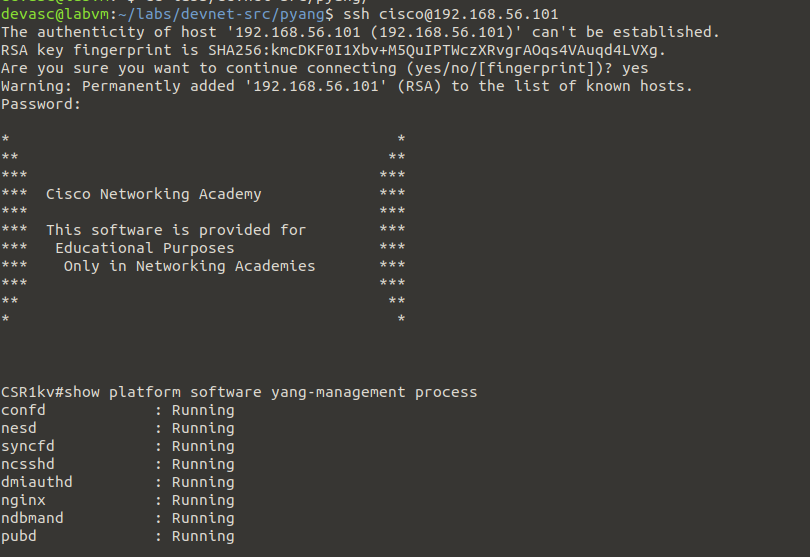
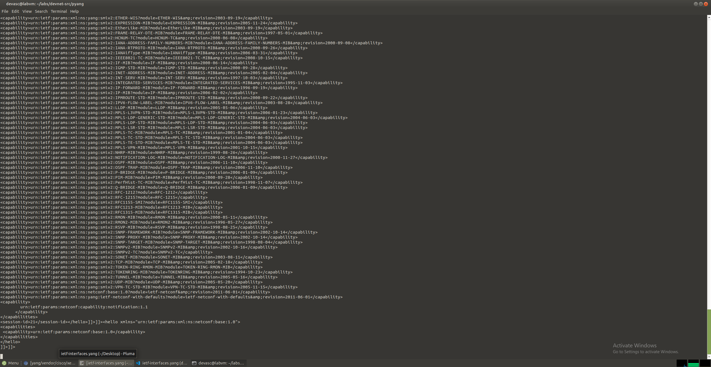
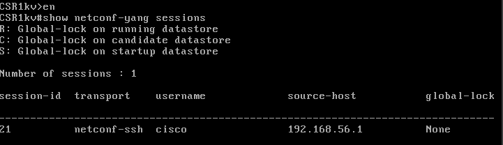
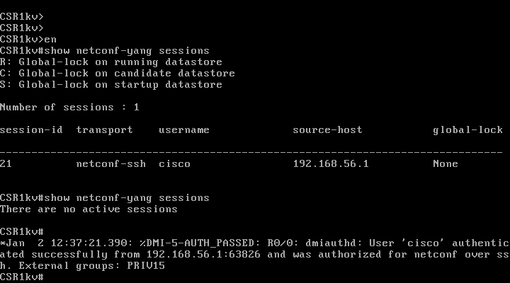
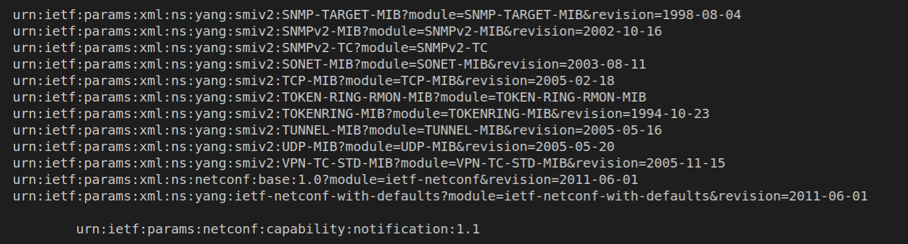
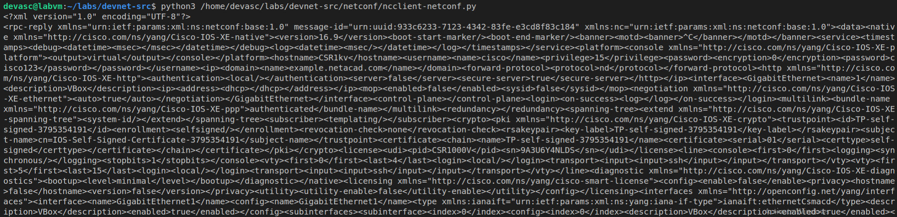
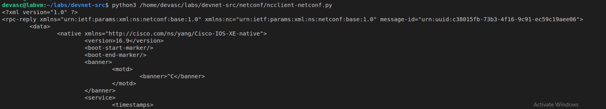
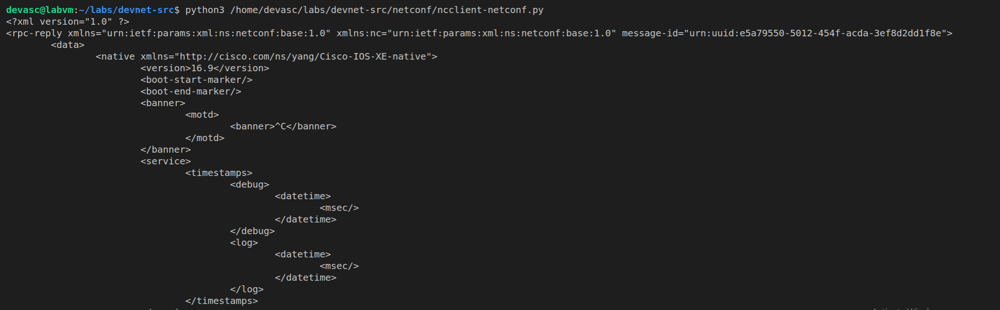
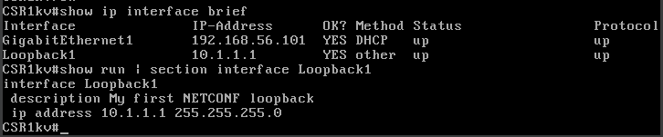
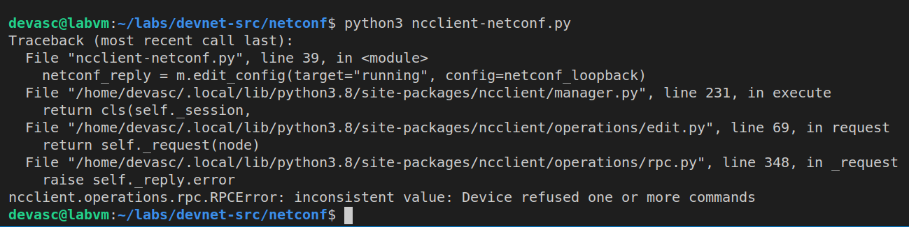

# Part 5: Use NETCONF to Access an IOS XE Device 


## Preparation and Implementation


First thing is to follow the steps in the `8.3.6-lab---use-netconf-to-access-an-ios-xe-device` pdf and make sure that the lab is setup properly 

For the Preparation for this lab, you have to have both the VM's up and running and connectable through SSH. and first we establish an SSH connection from the DEVASC vm to the Router. 

#### Part 2: Use a NETCONF Session to Gather Information

first we have to check if NETCONF is running on our router. we can do this with the following command: 

`show platform software yang-management process`



then we can establish a connection to the NETCONF process through an ssh, so we go out of the previous and reconnect to the NETCONF process using this command: 

`ssh cisco@192.168.56.101 -p 830 -s netconf` 

after this we have a netconf session. we can see this with the following output: 



after this, to create a new NETCONF session, we will paste the following code into our terminal

```xml
<hello xmlns="urn:ietf:params:xml:ns:netconf:base:1.0">
<capabilities>
 <capability>urn:ietf:params:netconf:base:1.0</capability>
</capabilities>
</hello>
]]>]]>
```

this will create a new session, and we can check this on our router itself by typing this into the vm: 

`show netconf-yang sessions`



to send an RPC message to this device, there is a couple of things you can do, but in this lab we will do a `get` message: 

```xml
<rpc message-id="103" xmlns="urn:ietf:params:xml:ns:netconf:base:1.0">
<get>
 <filter>
 <interfaces xmlns="urn:ietf:params:xml:ns:yang:ietf-interfaces"/>
 </filter>
</get>
</rpc>
]]>]]>

```

pasting this in our session, will give us a long string of XML code, we can paste this in a prettify xml client to get a prettier output, and we will get something along these lines: 

```xml
<?xml version="1.0" encoding="UTF-8"?>
<rpc-reply xmlns="urn:ietf:params:xml:ns:netconf:base:1.0" message-id="103">
  <data>
    <interfaces xmlns="urn:ietf:params:xml:ns:yang:ietf-interfaces">
      <interface>
        <name>GigabitEthernet1</name>
        <description>VBox</description>
        <type xmlns:ianaift="urn:ietf:params:xml:ns:yang:iana-if-type">ianaift:ethernetCsmacd</type>
        <enabled>true</enabled>
        <ipv4 xmlns="urn:ietf:params:xml:ns:yang:ietf-ip"/>
        <ipv6 xmlns="urn:ietf:params:xml:ns:yang:ietf-ip"/>
      </interface>
    </interfaces>
  </data>
</rpc-reply>
```

and we can see that this shows us the interface information. 

---

#### Part 3: Use ncclient to Connect to NETCONF

in our vm, we have a module `ncclient`. where we can make a NETCONF connection to our router through a script. this makes it easier to overlook and manage. 

we can first see if we can make a connection using the following code in a py file:

```py
from ncclient import manager
m = manager.connect(
 host="192.168.56.101",
 port=830,
 username="cisco",
 password="cisco123!",
 hostkey_verify=False
 )
```

and if we run the following code, we can check the router to see the following output: 



previously in our ssh connection, we could see the capabilities of our NETCONF session. we can paste this in a list using the same code by adding a couple of lines: 

```py
from ncclient import manager
m = manager.connect(
 host="192.168.56.101",
 port=830,
 username="cisco",
 password="cisco123!",
 hostkey_verify=False
 )

print("#Supported Capabilities (YANG models):")
for capability in m.server_capabilities:
 print(capability)
```

if we run this for loop, we get this as an output of running the code: 



#### Part 4: Use ncclient to Retrieve the Configuration

we can retrieve our configuration of the router through this NETCONF session. We can do this by adding a couple of lines of code to our python file to display the configuration. with the method `get_config()`. 

```py
from ncclient import manager
m = manager.connect(
 host="192.168.56.101",
 port=830,
 username="cisco",
 password="cisco123!",
 hostkey_verify=False
 )

netconf_reply = m.get_config(source="running")
print(netconf_reply)
```
we can run this code and get the following output: 



we can prettify this through the same program we used earlier. to make it more readable for us. but we can do this automatically using the following code instead: 

```py
from ncclient import manager
import xml.dom.minidom

m = manager.connect(
 host="192.168.56.101",
 port=830,
 username="cisco",
 password="cisco123!",
 hostkey_verify=False
 )

netconf_reply = m.get_config(source="running")
print(xml.dom.minidom.parseString(netconf_reply.xml).toprettyxml())
```

this will give the following output: 



to retrieve only a specific YANG model, we can specify a filter, with a parameter in our code: 

```py
from ncclient import manager
import xml.dom.minidom

m = manager.connect(
 host="192.168.56.101",
 port=830,
 username="cisco",
 password="cisco123!",
 hostkey_verify=False
 )

netconf_filter = """
<filter>
 <native xmlns="http://cisco.com/ns/yang/Cisco-IOS-XE-native" />
</filter>
"""

netconf_reply = m.get_config(source="running", filter=netconf_filter)
print(xml.dom.minidom.parseString(netconf_reply.xml).toprettyxml())

```

with this we will get a prettified xml with the specific filter:



in this, we have our Specific yang models removed and only have the ones we wanna see. 

#### Part 5: Use ncclient to Configure a Device

To configure a device using ncclient, we can use the `edit_config()`

we can create a new loopback interface on our router using the following code: 

```py

from ncclient import manager
import xml.dom.minidom

m = manager.connect(
 host="192.168.56.101",
 port=830,
 username="cisco",
 password="cisco123!",
 hostkey_verify=False
 )

netconf_loopback = """
<config>
<native xmlns="http://cisco.com/ns/yang/Cisco-IOS-XE-native">
 <interface>
 <Loopback>
 <name>1</name>
 <description>My first NETCONF loopback</description>
 <ip>
 <address>
 <primary>
 <address>10.1.1.1</address>
 <mask>255.255.255.0</mask>
 </primary>
 </address>
 </ip>
 </Loopback>
 </interface>
</native>
</config>
"""

netconf_reply = m.edit_config(target="running", config=netconf_loopback)
print(xml.dom.minidom.parseString(netconf_reply.xml).toprettyxml())

```

this will give an `ok` output, and we can go check on our router to see if the loopback got created: 



we can not create a new loopback interface with the same ip address, if we try this we get the following output: 




## Troubleshooting

There were no real problems in this case, it was pretty straight forward and worked pretty seemlesly


