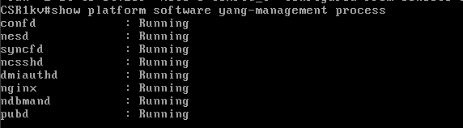
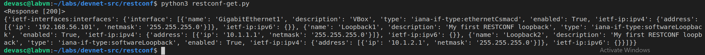

# Part 6: Use RESTCONF to Access an IOS XE Device 


## Preparation and Implementation
 

First thing is to follow the steps in the `8.3.7-lab---use-restconf-to-access-an-ios-xe-device` pdf and make sure that the lab is setup properly 

For the Preparation for this lab, you have to have both the VM's up and running and connectable through SSH. and first we establish an SSH connection from the DEVASC vm to the Router. 

---

### Part 2: Configure an IOS XE Device for RESTCONF Access

To make sure that everything is setup properly for our RESTCONF, we can check on our router for the processes if they are running or not: 

`show platform software yang-management process`

and you will get these results: 



if everything is correct and setup, you should see this, if not, you can enable both restconfig and nginx through these commands: 

first you enter the configterminal :

`CSR1kv#configure terminal`

followed by the following commands: 

```
CSR1kv(config)# restconf
CSR1kv(config)# ip http secure-server
CSR1kv(config)# ip http authentication local
```

and f you now check for the processes again, everything should be setup. 

---

### Part 3: Open and Configure Postman

to setup postman, we will open it on our vm. after this a couple of settings have to be done: 

Disable SSL certification verification.

By default, Postman has SSL certification verification turned on. You will not be using SSL certificates with the
CSR1kv; therefore, you need to turn off this feature.

1. Click File > Settings.
2. Under the General tab, set the SSL certificate verification to OFF.
3. Close the Settings dialog box

---

### Part 4: Use Postman to Send GET Requests

For postman to work, we will create a new GET Request, with the following setup:

for our URL we will use the ip of our router, including the restconf directory: 

`https://192.168.56.101/restconf/`

For authorization, we can click on the `Authorization` tab and add the credentials of our router: 


and for the headers, we will make sure that the body of our responses and request is in the right format, which would be `application/yang-data+json`


when we send this request to our router, we get this response: 


---

if we wanna get all our interfaces. we can go to the following url: 

`https://192.168.56.101/restconf/data/ietf-interfaces:interfaces`

if we send this request, we get the following response: 


---

if we wanna get a specific interface, we can go to the following url : 

`https://192.168.56.101/restconf/data/ietf-interfaces:interfaces/interface=GigabitEthernet1`

with the interface being the interface you want the configuration of. which in this case is `GigabitEthernet1`. if you wanna use an interface like G0/0/1, you can do this but you'll have to use the HTML code for the `/` which would be `%2F`. So G0/0/1 would look something along the lines of `G0%2F0%2F1`

If we send this request, we get the following response: 


which shows no IP, because its configured as DHCP which doesnt show. if we wanna see an IP, we'll have to manually add it by doing the following: 

First on our router, we'll configure our interface to use the ip we have been using `192.168.56.101`:


If we do the Get request this time, we'll see this instead: 


---

### Part 5: Use Postman to Send a PUT Request

For a PUT request, we'll need the same setup as our get requests, so our headers and authorization are the same.

since we have already created loopback1, we have to change the values of our loopback. 

The URL to add a new loopback interface would be this: 

`https://192.168.56.101/restconf/data/ietf-interfaces:interfaces/interface=Loopback2`

this will give you this response, since not everything has been specified in your body: 


you can add the following to your body to make sure that all options are in place to create a new loopback. it is `raw` data as well: 

```json
{
    "ietf-interfaces:interface": {
        "name": "Loopback2",
        "description": "My first RESTCONF loopback",
        "type": "iana-if-type:softwareLoopback",
        "enabled": true,
        "ietf-ip:ipv4": {
            "address": [
                {
                "ip": "10.1.2.1",
                "netmask": "255.255.255.0"
                }
            ]
        },
        "ietf-ip:ipv6": {}
    }
}
```

when we do this PUT request, we get a `201` response. and our loopback has been created: 


---

### Part 6: Use a Python script to Send GET Requests

The basics to use python scripts for the requests, is pretty much the same as our postman requests, just translated to python. which would look similar to this: 

```py
import json
import requests
requests.packages.urllib3.disable_warnings()

api_url = "https://192.168.56.101/restconf/data/ietf-interfaces:interfaces"

headers = { "Accept": "application/yang-data+json",
 "Content-type":"application/yang-data+json"
 }

basicauth = ("cisco", "cisco123!")
```

which is basically the headers and url of our requests. 

To get the response of a simple get request, the code would look something like this: 

```py
import json
import requests
requests.packages.urllib3.disable_warnings()

api_url = "https://192.168.56.101/restconf/data/ietf-interfaces:interfaces"

headers = { "Accept": "application/yang-data+json",
 "Content-type":"application/yang-data+json"
 }

basicauth = ("cisco", "cisco123!")

resp = requests.get(api_url, auth=basicauth, headers=headers, verify=False)

print(resp)
```

and we get this as a result: 


To display the JSON response, we can modify our script as follows: 

```py
import json
import requests
requests.packages.urllib3.disable_warnings()

api_url = "https://192.168.56.101/restconf/data/ietf-interfaces:interfaces"

headers = { "Accept": "application/yang-data+json",
 "Content-type":"application/yang-data+json"
 }

basicauth = ("cisco", "cisco123!")

resp = requests.get(api_url, auth=basicauth, headers=headers, verify=False)

response_json = resp.json()

print(resp)
print(response_json)
```
and gives this as an output: 



we can make this prettier using the function `json.dumps()` instead of a regular response_json print. the code snippet would look something like this: 

```py
print(json.dumps(response_json, indent=4))
```

and gives this as an output: 


---

### Part 7: Use a Python Script to Send a PUT Request

For a PUT request, we need the same imports of modules and variables as previously. with an additional body and a different url, the following is for a new loopback address: 
```py
import json
import requests
requests.packages.urllib3.disable_warnings()

api_url = "https://192.168.56.101/restconf/data/ietf-interfaces:interfaces/interface=Loopback3"

headers = { "Accept": "application/yang-data+json",
 "Content-type":"application/yang-data+json"
 }

basicauth = ("cisco", "cisco123!")

yangConfig = {
 "ietf-interfaces:interface": {
 "name": "Loopback3",
 "description": "My second RESTCONF loopback",
 "type": "iana-if-type:softwareLoopback",
 "enabled": True,
 "ietf-ip:ipv4": {
 "address": [
 {
 "ip": "10.1.3.1",
 "netmask": "255.255.255.0"
 }
 ]
 },
 "ietf-ip:ipv6": {}
 }
}
```

note that the Loopback is number 3 since 1 and 2 already exist. 

For the PUT request itself, you need the PUT request itself and a way to handle the requests: 

```py
resp = requests.put(api_url, data=json.dumps(yangConfig), auth=basicauth, headers=headers, verify=False)

if(resp.status_code >= 200 and resp.status_code <= 299):
 print("STATUS OK: {}".format(resp.status_code))
else:
 print('Error. Status Code: {} \nError message:{}'.format(resp.status_code,resp.json()))

```

the if else loop is to give the right response depending on the response of our request. 

if we try this with our variables from above, we get this response: 


and we can see the loopback in our router as well: 


there are a couple more than expected because of multiple attempts. 

## Troubleshooting

There were no real problems in this case, it was pretty straight forward and worked pretty seemlesly


