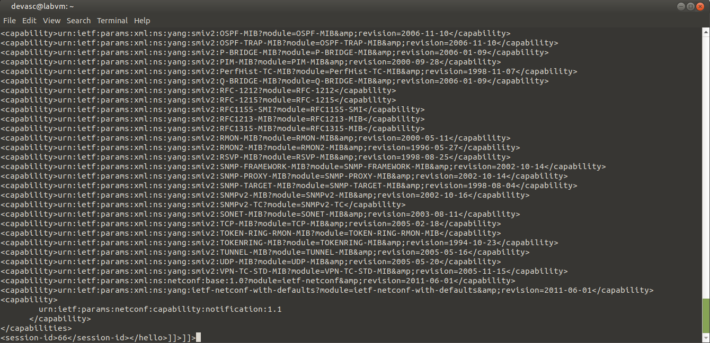
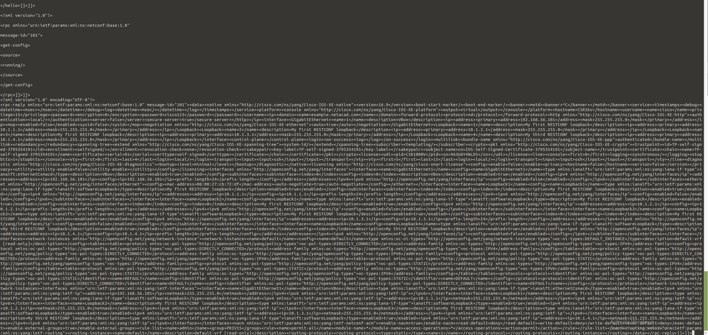
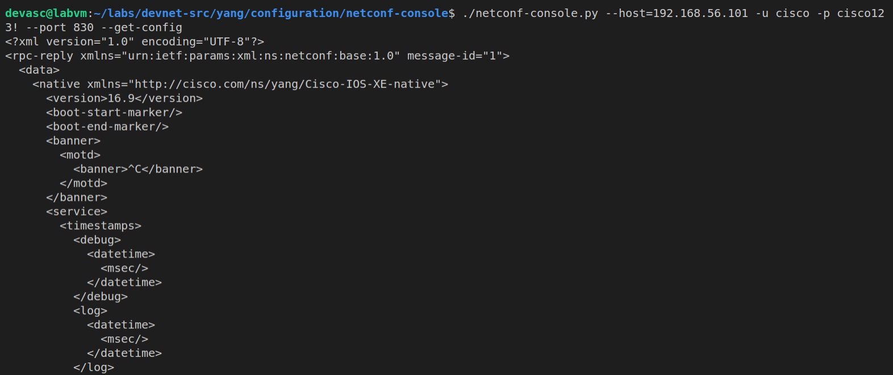

# Part 7: Getting started with NETCONF/YANG – Part 1


## Preparation and Implementation

First start off with the reading this forum: https://community.cisco.com/t5/networking-blogs/getting-started-with-netconf-yang-part-1/ba-p/3661241

To make a connection you can use what we previously used to make a NETCONF connection through ssh, with the following command: 

`ssh -p 830 cisco@192.168.56.101`

and you will get the XML response of your router, which contains all the capabilities: 



to continue the session, you need to respond to the hello with a list of capabilities you wanna use. these capabilities represent what you can do through these requests and with the NETCONF session. 

we can just use the base to continue this session: 

```

<?xml version="1.0" encoding="UTF-8"?>

<hello xmlns="urn:ietf:params:xml:ns:netconf:base:1.0">

<capabilities>

  <capability>urn:ietf:params:netconf:base:1.0</capability>

</capabilities>

</hello>]]>]]>
```

with this combination `]]>]]>` indicating the end of the message. 
 

we can check the transport by trying a simple command which gives us the full running config of our router:

```

<?xml version="1.0"?>

<rpc xmlns="urn:ietf:params:xml:ns:netconf:base:1.0"

message-id="101">

<get-config>

<source>

<running/>

</source>

</get-config>

</rpc>]]>]]>
```

with as a response: 




As for a NETCONF tool. we have to do a couple of things. we first have to install python2 onto our vm. 

We can do this using these commands: 

```
sudo apt update
sudo apt install python2
```

after that, we have to make sure that we export a certain variable so that the application can run smoothly: 

```
export PYTHONWARNINGS="ignore"
```

and finally, we have to install xmllint using these commands: 

```
sudo apt-get update 
sudo apt-get install -y libxml2-utils
```

and now everything should be good for the `netconf-console`. but to use it we first have to clone the whole repository `https://github.com/OpenNetworkingFoundation/configuration.git` and change the `#!/usr/bin/python` to `#!/usr/bin/python2` since we are using python2. 

now we can get the running config of our router using this command: 

`./netconf-console.py --host=192.168.56.101 -u cisco -p cisco123! --port 830 --get-config`

and this will give this output: 



this resposne is in XML, also known as structured data. and it is already put in pretty print so this is easier to read. 

Structured data in XML for NETCONF is a hierarchical, machine-readable format used to represent network device configurations and operational states. It uses tags to encapsulate data, following schemas defined by YANG models, which ensure consistency and validation.

Key Features:
- Hierarchy: Data is organized in a tree-like structure (e.g., `<interfaces>` containing `<interface>` elements).
- Self-Descriptive: Tags like `<name>` or `<status>`make data meaningful and readable.
- Schema-Driven: YANG models define data structure, types, and constraints.
= Use Cases:
  - Retrieve data (`<get>` or `<get-config>`).
  - Modify configurations (`<edit-config>`).
  - Validate or lock data.


## Troubleshooting

the biggest issue was getting the NETCONF tool to work properly inside of the vm, installing the right packages and making sure everything ran simultaneously.


