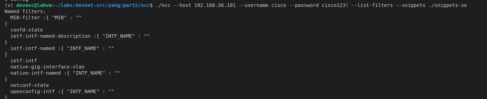

# Part 8: Getting started with NETCONF/YANG – Part 2 


## Preparation and Implementation
 
 so, For this specific lab, we need to clone a git repository and create a virtual env. we can do this the following way: 

 ```sh
git clone https://github.com/CiscoDevNet/ncc.git

cd ncc

virtualenv v

. v/bin/activate

pip install --upgrade pip

pip install -r requirements.txt
 ```


which will clone the NETCONF Client repository, which is followed by creating a virtual environment, and installing the required modules for ncc to work. once this is done we can try the following command in our terminal and see how this works by asking the router for its capabilities: 

```sh
./ncc --host 192.168.56.101 --username cisco --password cisco123! --capabilities
```

and this gives the following as an output: 


--- 


### Containers
A container is a grouping construct in a YANG data model. It is used to organize related data into a logical grouping without carrying any direct value itself. Containers are similar to folders in a filesystem that hold other elements, such as leaves, other containers, or lists.

Key Characteristics:
 1. Structural Grouping: Containers do not carry their own value but serve as a parent node for grouping related child nodes.
 2. Child Nodes: Containers can include:
    - Other containers (nested grouping).
    - Leaves (individual data points).
    - Lists (collections of elements).
    - Leaf-lists (lists of scalar values).
 3. Optional or Mandatory: Containers can be defined as optional or mandatory using the presence statement in YANG.

Example in YANG:
 ```yang
container interface {
    description "Interface configuration";
    leaf name {
        type string;
        description "The name of the interface";
    }
    leaf enabled {
        type boolean;
        default true;
        description "Whether the interface is enabled";
    }
}

``` 
XML Representation:

```xml
<interface>
    <name>GigabitEthernet0/0</name>
    <enabled>true</enabled>
</interface>
``` 

### Leaves
A leaf is a single data point or configuration parameter. It represents a scalar value (e.g., string, integer, boolean) and does not have child nodes. Leaves are the "end points" of the data hierarchy.

Key Characteristics:
 1. Scalar Value: A leaf contains exactly one value, such as an IP address, an interface name, or a boolean status.
 2. Data Types: Leaves can have different data types like string, int32, boolean, or enumeration, which are defined in the YANG model.
 3. Default Values: Leaves can have default values defined in the YANG model.


Example in YANG:
```yang
leaf hostname {
    type string;
    description "The hostname of the device";
}
```
XML Representation:

```xml
<hostname>Router1</hostname>
```
---

we can also use filters to see what specific options are in our ncc and our router: 




--- 

There are 2 types of data, `Configuration Data` and `Operational Data`. but what is the big difference between these 2 ? 

### Configuration Data
Configuration data represents the settings and parameters that determine how a device operates. It is data explicitly set by an administrator or automated system and stored persistently in the device's configuration database.

Key Characteristics:
 1. Editable: Can be modified by a user or an application using NETCONF or other management protocols.
 2. Persistent: Retained across device reboots or power cycles.
 3. Purpose: Defines the desired state or behavior of the network device.
 4. Example Use Cases:
    - Setting IP addresses on interfaces.
    - Configuring routing protocols like OSPF or BGP.
    - Defining VLANs or access control lists (ACLs).
 
### Operational Data (Statistics)
Operational data, often referred to as state data, represents real-time or statistical information about the device's operation. This data is typically read-only and reflects the current state of the device, often derived from the running system.

Key Characteristics:
 1. Read-Only: Cannot be modified directly (though it may change as a result of configuration changes or device behavior).
 2. Dynamic: Changes in real time as the device operates.
 3. Non-Persistent: Not retained across reboots unless explicitly logged or exported.
 4. Purpose: Provides insight into the actual state or performance of the device.
 5. Example Use Cases:
    - Interface status (up/down).
    - Packet counters or error rates.
    - Current OSPF neighbors or BGP session states.


to edit our router, we can go check in the `snippets` or `snippets-xe` folder which contains a bunch of templates to make changes to our router. 

but to do this you have to change the namespaces in the templates since most of these templates arent supported for the router we're using. 

---


## Troubleshooting

There were no real problems in this case, it was pretty straight forward and worked pretty seemlesly

## verification

