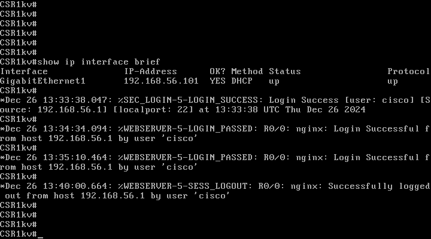
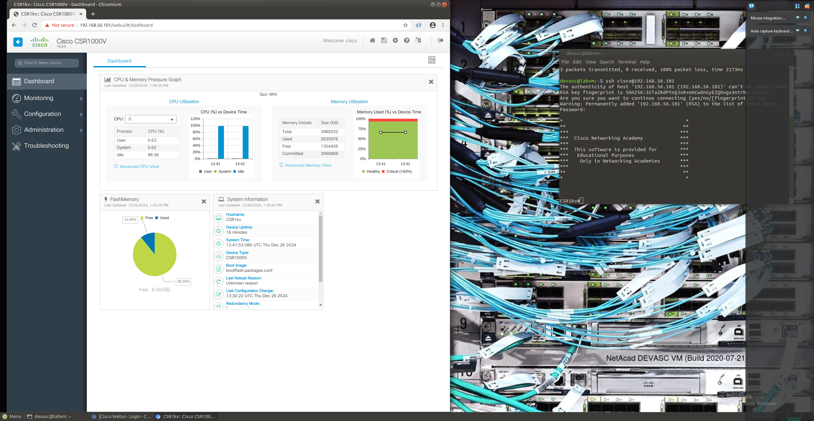

# Part 2: Install the CSR1000v VM

## Preparation and Implementation

First thing is to follow the steps in the `7.0.3-lab---install-the-csr1000v-vm` pdf and make sure that the lab is setup properly 

## Troubleshooting

There were no real problems in this case, it was pretty straight forward and worked pretty seemlesly

## verification

---

