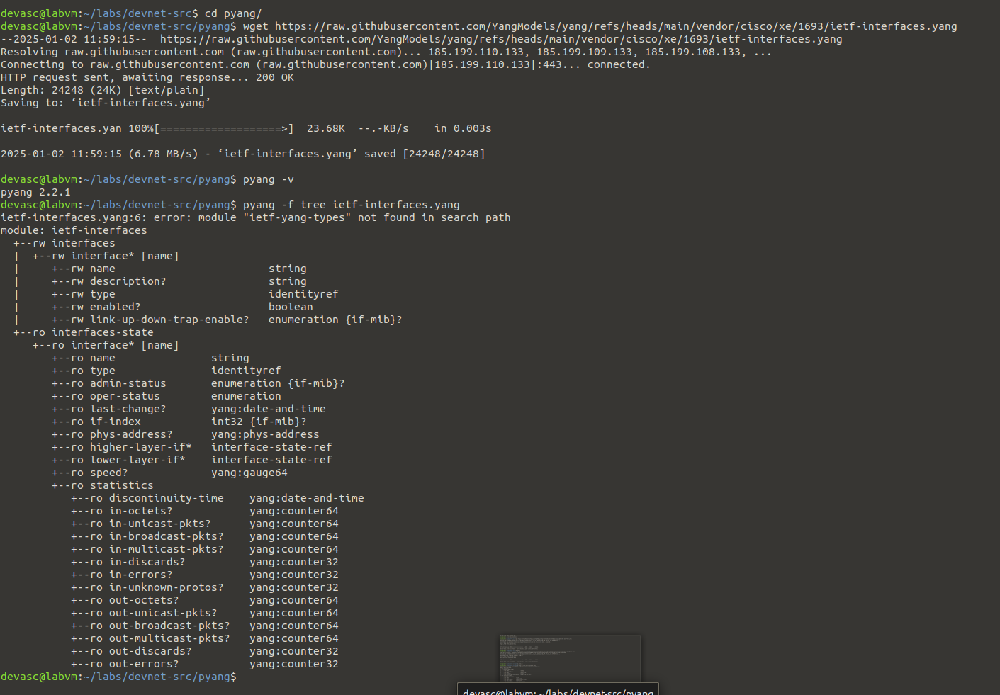

# Part 4: Explore YANG Models

## Preparation and Implementation
 
First thing is to follow the steps in the `8.3.5-lab---explore-yang-models` pdf and make sure that the lab is setup properly 

## Troubleshooting

There were no real problems in this case, it was pretty straight forward and worked pretty seemlesly

## verification

